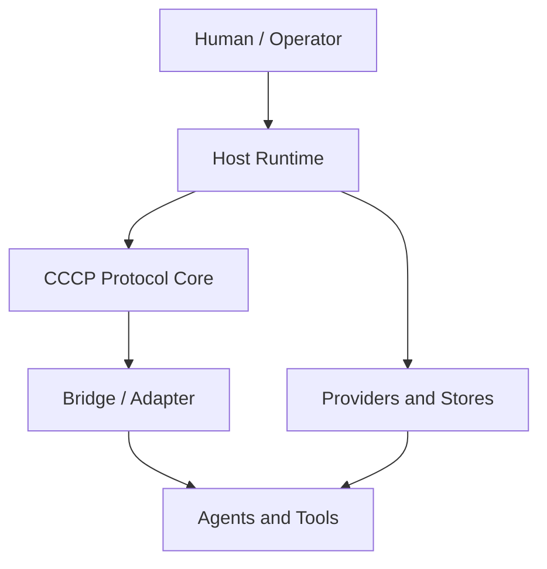
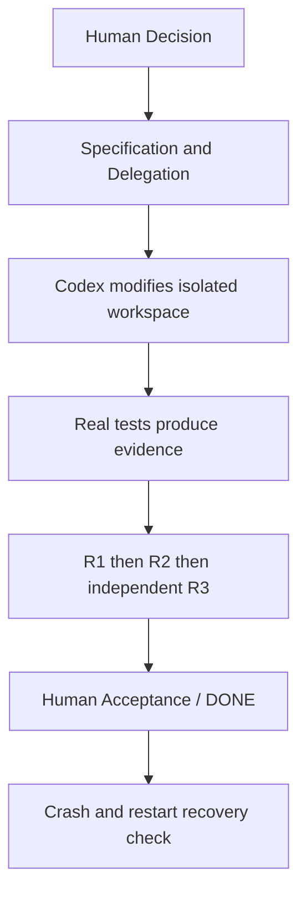

# CCCP 一期架构评估与修改指南

> 文档状态：一期方案 / 待 Human 批准后实施  
> 评估日期：2026-09-17  
> 适用基线：CCCP Protocol 1.0、`cccp-reference` 0.1.1 及当前优化结果  
> 本期目标：将已经成形的协议参考实现推进为可接入真实 Agent、可持久恢复、可约束工具副作用的 Reference Runtime v0.2。

---

## 1. 执行摘要

CCCP 当前并不是“只有文档、没有实现”的空中协议。现有工程已经具备机器可读 Schema、带守卫的生命周期 Controller、权限与 Delegation 约束、R1/R2/R3 Review 机制、Repository Discovery、Codex Adapter、进程内 Bridge、审计链与回归测试。最新基线为 **103 PASS / 0 FAIL**；macOS `/var` 与 `/private/var` 的真实路径兼容问题也已被修复并增加回归测试。

当前真正的架构断层在协议之上：系统尚未正式定义并实现一个承担身份认证、Agent 调用、持久状态、工具隔离、工作区管理、证据存储和恢复协调的 **Host Runtime**。因此，下一阶段不应继续向 Protocol Core 增加生命周期状态，而应新增 Runtime Plane，并保持 CCCP 1.0 的 Human Authority、Decision Boundary、Delegation 与 Review 语义冻结。

一句话判断：

> **CCCP 已有相对完整的 Control Plane，但缺少可长期运行的 Runtime Plane。**

本期建议的版本定位是：

- 协议版本保持 `CCCP 1.0`；
- Reference Implementation 从 `0.1.1` 演进到 `0.2.0`；
- 本次属于运行时架构扩展，不默认构成 `CCCP 1.1`；
- 只有当实现发现现有冻结语义无法表达必要行为时，才提交独立 `CHANGE_PROPOSAL`，由 Human 决定是否修改协议。

---

## 2. 评估依据与已确认基线

本指南以以下材料为依据：

1. `IMPLEMENTATION_REPORT.md`：首版 Core、Controller、Adapter、Bridge、Schema、Review 与审计链实现情况；
2. `OPTIMIZATION_REPORT.md`：阻断恢复、并发锁、执行身份、状态版本、Schema 校验、Git 暂存区指纹等加固结果；
3. `2026-09-16-v0.1.1-macos-compatibility.md`：macOS 仓库真实路径身份修复；
4. 当前冻结的 `CCCP v1.0 Design Guide`、`IMPLEMENTATION_SPEC.md`、`CODEX_ADAPTER_SPEC.md`、`CONFORMANCE.md`。

已确认的工程基线：

| 能力 | 当前状态 | 判断 |
|---|---|---|
| Protocol Schema 与生命周期 | 已实现 | 不是本期重写对象 |
| Human Approval / Delegation / Autonomy 边界 | 已实现并测试 | 保持冻结 |
| R1、逐条证据 R2、条件式 R3 | 已实现机制 | 真实独立 R3 尚未接入 |
| Repository Discovery 与 freshness | 已实现并加固 | 可作为 Runtime 输入 |
| Codex Adapter 与进程内 Bridge | 已实现 | 需要连接真实 Runtime |
| 并发锁与 `state_version` | 单进程范围已加固 | 尚不能替代跨进程一致性 |
| Audit、去重和 Controller 状态 | 主要为进程内 | 需要持久化与恢复 |
| 工具权限检查 | 应用层已实现 | 不是 OS sandbox |
| 真实 ChatGPT / Codex / MCP 调用 | 未接入 | P0 |
| 生产身份认证 | 未接入 | P0 |
| 独立 ChatGPT R3 | 未执行 | P0 E2E 的组成部分 |

---

## 3. 当前架构判断

### 3.1 已经解决的问题

CCCP Core 已经能够回答：

- 谁可以形成 Decision；
- Specification 与 Decision 如何区分；
- Codex 在什么 Delegation 范围内执行；
- 哪些操作需要升级或重新获得 Human Approval；
- R1、R2、R3 分别检查什么；
- Revision、Replan、Blocked、Human Stop 如何改变生命周期；
- Repository 观察何时过期，过期后为何不能继续执行；
- Adapter 与 Bridge 为什么不能自批设计或扩张权限。

这些属于协议控制语义，已经有实现与测试，不应因为要接真实模型而重新设计。

### 3.2 尚未解决的问题

当前系统还不能完整回答：

- `actor` 的真实身份由谁认证，如何映射到 protocol principal；
- ChatGPT、Codex 或其他 Agent 由谁启动、取消和记录；
- Controller、Session、Audit、去重记录如何在进程退出后恢复；
- 工具失败、超时或进程被杀死后，外部副作用处于什么状态；
- 两个任务或两个进程如何安全操作同一个 Git repository；
- Review 中的“测试通过”如何绑定到可验证、不可混淆的证据；
- Host、Adapter、Bridge 和 Agent 能力不同时如何协商；
- 如何证明第三方 Host 也符合 CCCP，而不只是当前实现自己通过测试。

这些不是继续增加 Core 状态就能解决的问题，而是 Runtime、Persistence、Sandbox、Workspace 与 Evidence 的职责。

### 3.3 目标分层



`Host Runtime` 是正式新增的架构层，负责真实世界接线与运行保障；`Protocol Core` 继续负责权限、状态与审查语义。两者不得相互吞并。

---

## 4. 修改原则与边界

### 4.1 必须遵守的原则

1. **冻结协议优先。** 不因实现方便改变 Human Authority、Decision Boundary、Review 职责或 Replan 审批规则。
2. **Runtime 不伪装成协议。** 数据库、队列、进程管理、模型 SDK、OS sandbox 属于实现层；除非影响参与者可观察的互操作语义，否则不升级协议版本。
3. **所有副作用都要可追踪。** “工具返回错误”不等于“没有修改任何东西”；Runtime 必须记录副作用是否已知。
4. **Repository is Reality。** Agent 文本声明不能替代文件、Git、命令结果与内容哈希等证据。
5. **恢复不能扩大权限。** 重启、重试、超时恢复、消息重放都不得产生新的 Delegation 或绕过 Human Approval。
6. **先做单机持久 Runtime，再做分布式。** v0.2 不应一开始引入微服务、分布式共识或复杂消息中间件。
7. **一次只替换一个不确定性来源。** 先建立 Runtime contract 与可恢复存储，再接真实 Agent 和工具隔离，避免同时改变全部路径后无法定位故障。

### 4.2 本期明确不做

- 不设计 CCCP 1.1 的新生命周期；
- 不宣称达到多租户生产 SaaS 安全级别；
- 不做任意自然语言 Decision 与代码改动之间的自动语义等价证明；
- 不强制支持跨机器分布式执行；
- 不把某一家模型 API、Codex CLI 或 MCP 写死在 Core；
- 不以 Docker 本身等同于完整安全沙箱；
- 不把现有 103 项测试替换掉，应在其上增加 Runtime 与 E2E 测试。

---

## 5. 缺口分级与修改总览

| 优先级 | 缺口 | 本质 | 本期动作 |
|---|---|---|---|
| P0 | Host Runtime Contract | 缺少统一运行宿主 | 新增正式 Runtime 层与 SPI |
| P0 | Durable State / Crash Recovery | 状态只能活在进程内 | Event Log + Snapshot + CAS + Idempotency |
| P0 | ToolRunner / Effect Model | 权限检查不等于副作用隔离 | 定义执行边界、取消和结果语义 |
| P0 | AgentProvider | principal 尚未成为真实 Agent | 接入实现但保持厂商无关 |
| P0 | 真实 E2E 与独立 R3 | 机制存在但未形成真实闭环 | 在测试仓库跑完整流程与 crash recovery |
| P1 | Evidence Artifact | 证据仍可能只是文本 | 引用可验证 Artifact |
| P1 | Workspace / Repository Lease | 单 Controller 锁不足以处理多任务 | task-workspace 绑定与仓库租约 |
| P1 | Capability / Version Negotiation | Host 能力与版本未显式表达 | 建立 manifest 与兼容规则 |
| P2 | Threat Model | 防御措施缺少统一信任模型 | 编写正式威胁模型 |
| P2 | External Conformance Suite | 只证明当前实现符合自身预期 | 抽离黑盒一致性测试 |
| P2 | CI / Release / Distribution | 工程交付尚未稳定 | 多平台 CI、tag、changelog、package 策略 |

优先级的准确含义是：

- **P0：让 CCCP 成为真实、可恢复的系统；**
- **P1：让该系统能够安全扩展、并发和演化；**
- **P2：证明其成熟、可移植和可交付。**

P1 并非纯理论问题，P2 也不只是“现实环境没跑过”；三者区别主要是当前 v0.2 闭环对它们的依赖程度。

---

## 6. P0 详细修改指南

### 6.1 建立 Host Runtime Contract

建议新增：

```text
docs/HOST_RUNTIME_SPEC.md
src/runtime/
  host-runtime.mjs
  runtime-context.mjs
  errors.mjs
  providers/
  stores/
```

Host Runtime 至少组合以下六类端口：

| 端口 | 主要责任 | 禁止承担的责任 |
|---|---|---|
| `IdentityProvider` | 认证调用方并映射 principal | 根据消息自报角色直接信任身份 |
| `AgentProvider` | 调用、取消、记录真实 Agent | 代替 Human 批准 Decision |
| `StateStore` | 状态、事件、幂等与 CAS | 自行决定生命周期转移是否合法 |
| `ToolRunner` | 运行工具并约束实际能力 | 自行扩展 Delegation |
| `WorkspaceManager` | 创建、绑定、租约与清理 workspace | 用路径字符串猜测仓库身份 |
| `EvidenceStore` | 保存并校验证据 Artifact | 把 Agent 自述自动升级为事实 |

建议由 `HostRuntime` 负责装配这些能力，并通过现有 Controller 完成状态转移。Controller 仍然是协议状态守卫的唯一权威入口；Store 不应复制一套业务状态机。

最低接口要求：

```js
// 概念接口，具体命名可按现有代码风格调整。
class HostRuntime {
  async startTask(input) {}
  async resumeTask(taskId) {}
  async dispatchAgent(request) {}
  async executeTool(request) {}
  async submitReview(result) {}
  async recoverTask(taskId) {}
  async stopTask(taskId, actor) {}
}
```

每次调用必须携带或可解析出：`task_id`、`principal`、`state_version`、`delegation_ref`、`workspace_ref`、`correlation_id`。不要依赖全局当前任务。

验收标准：

- 使用内存 Provider 与持久 Provider 时，Core 行为一致；
- Runtime 不可绕开 Controller 直接推进生命周期；
- forged role、缺失 principal、过期 `state_version` 均被拒绝；
- Runtime contract 有独立单元测试和文档示例。

### 6.2 Durable State 与 Crash Recovery

不要仅把 Controller 对象定期序列化为 JSON。建议采用最小可行的持久模型：

```text
Append-only Event Log
        +
Periodic Snapshot
        +
state_version Compare-And-Swap
        +
Inbox / Outbox
        +
Idempotency Record
```

首期可选择 SQLite 作为单机实现，以事务同时提交：

1. 领域事件；
2. 最新 `state_version`；
3. Audit entry；
4. 待投递 Outbox 消息；
5. 幂等键或操作尝试记录。

建议的持久实体：

- `tasks`：任务元数据、当前状态、版本、Decision 与 Delegation 引用；
- `events`：只追加事件流，含 actor、timestamp、causation/correlation；
- `snapshots`：Controller 可恢复快照及其 event offset；
- `inbox`：已接收消息与处理结果；
- `outbox`：待发送、已发送、投递不确定的消息；
- `operation_attempts`：工具幂等键、开始/结束时间、效果状态；
- `audit_entries`：可验证链或其持久化表示；
- `sessions`：Bridge/Agent session 的范围、过期与撤销状态。

恢复流程必须遵循：

1. 读取最新 snapshot；
2. 重放 snapshot 之后的事件；
3. 校验 Audit 与 `state_version` 连续性；
4. 检查处于 `RUNNING` 但没有终态的 operation；
5. 将无法证明结果的 operation 标记为 `EFFECT_UNKNOWN`，不得自动当作失败重试；
6. 重投 Outbox 前使用稳定幂等键；
7. 恢复后的权限不得超过崩溃前已批准范围。

必须增加的故障注入测试：

- Human Approval 提交前后崩溃；
- 工具开始后、结果写入前崩溃；
- R2 完成后、Review 消息确认前崩溃；
- Outbox 已发送但确认丢失；
- 相同 Bridge 消息重复到达；
- 旧进程持有过期 `state_version` 并尝试写入；
- Human Stop 后重启并尝试由 Codex resume。

验收标准：在上述位置杀死并重启进程后，系统不得重复扩大副作用、跳过 Review、丢失 Human Stop 或伪造 DONE。

### 6.3 ToolRunner 与 Effect Model

现有 Adapter 的路径、身份、状态和并发检查应继续保留，但它们只是执行前授权，不是执行环境隔离。新增 `ToolRunner`，至少定义：

- 固定 `cwd` 与 workspace 身份；
- 文件系统读写 allowlist；
- 环境变量 allowlist 与敏感值过滤；
- 网络策略；
- 命令/工具 allowlist；
- timeout、进程树取消与输出上限；
- CPU、内存、文件大小等资源限制；
- stdout/stderr、exit code 与时间记录；
- 执行前后 repository fingerprint；
- effect reconciliation。

建议将工具运行结果与协议层任务状态分开，定义 Runtime 结果：

| 结果 | 含义 | 默认处理 |
|---|---|---|
| `SUCCEEDED` | 命令完成且结果已记录 | 允许进入验证，但不等于任务完成 |
| `FAILED_CLEAN` | 已确认失败且没有持久副作用 | 可按预算重试 |
| `EFFECT_UNKNOWN` | 无法确认是否已产生副作用 | 阻断自动重试，先 Discovery/Reconcile |
| `INTERRUPTED` | 被取消、超时或宿主终止 | 重新发现真实状态，再决定后续 |

不要把这些值直接塞进现有 Protocol Lifecycle；它们首先是 Runtime execution outcome。只有在需要参与者互操作且现有消息无法表达时，才发起协议变更提案。

首期隔离可采用受限子进程或容器后端，但必须明确记录其保证和不保证的边界。测试必须包括 symlink/junction、路径别名、子进程逃逸、超时后残留进程、输出爆量及网络策略。

### 6.4 AgentProvider 与真实角色接入

ChatGPT、Codex 是 CCCP 中的角色/principal，不应与某个固定 SDK 类绑定。建议接口至少支持：

```js
class AgentProvider {
  async capabilities() {}
  async deliberate(request) {}
  async implement(request) {}
  async review(request) {}
  async cancel(runId) {}
  async inspect(runId) {}
}
```

每次 Agent run 必须记录：

- provider 与 model；
- principal 与 role；
- prompt/template version；
- context snapshot 与 repository snapshot；
- allowed tools 与 Delegation；
- input/output schema；
- run id、token/时间统计、终止原因；
- 产出的 Evidence 引用。

真实接线顺序建议：

1. 先实现 `FakeAgentProvider`，验证 Runtime contract；
2. 接入一个真实 Codex implement 后端；
3. 接入独立 ChatGPT review 后端；
4. 最后再增加第二种 provider，验证没有被第一家 API 锁死。

安全要求：repository 内容、工具输出和 Agent 文本全部按不可信输入处理；Agent 无权通过自然语言自称 Human 或自行扩大 Delegation。

### 6.5 真实 E2E 与独立 R3

本期的完成标志不是“新模块都有单元测试”，而是以下真实闭环可重复运行：



测试仓库应是可丢弃的 fixture 或专用 repository，不直接用 CCCP 主仓库作为第一次有副作用的实验对象。

E2E 至少验证两条路径：

1. **正常路径**：真实 Codex 修改文件 → 真实测试 → R1 → R2 → 独立 ChatGPT R3 → Human Acceptance → DONE；
2. **恢复路径**：在工具执行后或 Review 投递阶段强制终止 Host → 重启 → 重建状态与审计 → 发现副作用 → 不重复越权执行 → 完成剩余 Review。

R3 必须是独立 run，不能由实施该改动的同一个 Agent run 自审；其输入应基于冻结 Decision、Specification、diff、测试 Evidence 和 repository snapshot。

---

## 7. P1 设计预留

P1 不要求全部阻塞 v0.2 的第一个 E2E，但 P0 接口必须为它们保留清晰扩展点。

### 7.1 EvidenceArtifact

将 Review 中的自由文本证据逐步替换为对象引用：

```text
EvidenceArtifact
- evidence_id
- type: TEST_RUN | COMMAND_RUN | FILE | DIFF | COMMIT | REVIEW
- task_id / operation_id
- repository_snapshot
- command or producer
- exit_code / status
- content_hash
- artifact_ref
- created_at
- principal
```

Review Result 仍可提供解释文本，但 PASS 应引用可验证 Artifact。`UNKNOWN` 不得因存在一段自然语言说明而自动升级为 PASS。

### 7.2 WorkspaceManager 与 RepositoryLease

Task 应绑定到明确 workspace/worktree，而不是仅保存 repository path。建议提供：

- `createWorkspace(taskId, repositoryRef, baseRevision)`；
- `acquireLease(repositoryIdentity, taskId, mode)`；
- `renewLease(leaseId)`；
- `releaseLease(leaseId)`；
- `inspectWorkspace(workspaceRef)`；
- `disposeWorkspace(workspaceRef)`。

首期可只支持同一 repository 的单写者租约；未来再扩展多个只读者、不同 worktree 并行与跨进程协调。租约失效不代表运行中的进程已被安全终止，仍需与 ToolRunner reconciliation 配合。

### 7.3 Capability 与版本协商

Host 启动时应暴露 manifest，例如：

```json
{
  "protocol_versions": ["1.0"],
  "runtime_version": "0.2.0",
  "capabilities": {
    "durable_state": true,
    "crash_recovery": true,
    "tool_cancellation": true,
    "os_sandbox": "process",
    "independent_r3": true
  }
}
```

必须区分：协议版本、实现版本、持久化 schema 版本、Provider 能力。未知必需能力应拒绝启动或进入显式 Blocked，不能静默降级。

---

## 8. P2 成熟度路线

### 8.1 Threat Model

新增 `docs/THREAT_MODEL.md`，至少明确：

- Human/operator 是否为 trust root；
- Host 是否被假定可信；
- Agent 输出、repository 内容、工具输出和远端消息均不可信；
- 攻击面包括身份伪造、prompt injection、路径逃逸、命令注入、凭据泄露、重复投递、stale state、恶意/错误工具、审计篡改；
- Host 被攻破后系统还承诺什么、不承诺什么；
- 各防线属于预防、检测还是恢复。

### 8.2 External Conformance Suite

将现有 AC-01～AC-20 和 C-01～C-04 中可黑盒验证的部分抽成独立 runner，使第三方 Host/Adapter 可以接受同样测试，而不是导入内部类完成自证。

目标形态可类似：

```bash
cccp-conformance --target ./my-host-adapter
```

重点证明：不可 self-approve、过期 Discovery 不可执行、Replan 需要 Human Approval、UNKNOWN evidence 不可视为 PASS、重复消息不产生重复副作用。

### 8.3 CI、Release 与 Distribution

建议在 Runtime v0.2 稳定后补齐：

- Linux / macOS / Windows 的普通 PR CI；
- 明确支持的 Node.js LTS 矩阵；
- Schema consistency、unit、integration、E2E 分层；
- release tag 与 changelog；
- 数据库 migration 测试；
- package 是否继续 `private` 的发布决策；
- 安全扫描作为补充，而不是替代 CCCP 自身 Review。

---

## 9. 推荐实施顺序

### M0：冻结基线与架构决策

产出：

- Architecture Decision Record：新增 Host Runtime，不修改 CCCP 1.0；
- `HOST_RUNTIME_SPEC.md` 初稿；
- Runtime capability manifest；
- 当前 103 项测试与 macOS 回归保持通过。

退出条件：各模块职责、数据所有权、错误边界与协议/实现版本边界明确。

### M1：Runtime Skeleton + In-memory Providers

产出：

- `HostRuntime` 编排骨架；
- 六类 Provider/Store contract；
- Fake/In-memory 实现；
- Controller 只能通过既有公共接口推进；
- contract tests。

退出条件：模拟 workflow 通过新 Runtime 运行，旧 demo 行为不回退。

### M2：Durable State + Recovery

产出：

- SQLite StateStore；
- event/snapshot/inbox/outbox/idempotency 数据模型；
- migration 与恢复命令；
- crash injection 测试。

退出条件：进程在关键节点崩溃后可恢复，且不重复副作用、不丢失审批、不跳过 Review。

### M3：ToolRunner + Workspace

产出：

- 受限 ToolRunner 后端；
- effect outcome 与 reconciliation；
- 临时 Git worktree/fixture workspace；
- 单写者 RepositoryLease；
- 路径、取消、超时与残留进程测试。

退出条件：工具权限由实际执行环境约束；中断结果不会被误当作 clean failure。

### M4：真实 Agent + 独立 R3 + E2E

产出：

- 真实 Codex AgentProvider；
- 独立 ChatGPT Review provider；
- EvidenceArtifact 最小实现；
- 正常与恢复两条真实 E2E；
- E2E 审计报告。

退出条件：完整闭环可重复运行，并在至少一个强制崩溃点后恢复完成。

### M5：P1/P2 加固

产出：多任务租约、能力协商完整规则、Threat Model、外部 Conformance、CI/release。

退出条件：不再只证明“当前代码能跑”，而能证明 Runtime 可移植、可演化、可交付。

---

## 10. 代码修改建议清单

以下是建议结构，不要求机械照搬命名，但职责不可重新混合：

```text
docs/
  HOST_RUNTIME_SPEC.md
  PERSISTENCE_SPEC.md
  TOOL_RUNNER_SPEC.md
  THREAT_MODEL.md                 # P2
  adr/
    0001-host-runtime-layer.md

src/
  runtime/
    host-runtime.mjs
    runtime-context.mjs
    capability-manifest.mjs
    errors.mjs
    providers/
      agent-provider.mjs
      identity-provider.mjs
      fake-agent-provider.mjs
    stores/
      state-store.mjs
      memory-state-store.mjs
      sqlite-state-store.mjs
      evidence-store.mjs
    tools/
      tool-runner.mjs
      process-tool-runner.mjs
      effect-reconciler.mjs
    workspace/
      workspace-manager.mjs
      repository-lease.mjs

tests/
  runtime-contract.test.mjs
  persistence.test.mjs
  crash-recovery.test.mjs
  tool-runner.test.mjs
  workspace.test.mjs
  e2e-real-agents.test.mjs
```

与现有代码的关系：

- `lifecycle.mjs`：继续拥有协议状态守卫，不下沉数据库或模型 SDK；
- `adapter.mjs`：继续执行协议侧前置检查，通过 ToolRunner 发起真实执行；
- `execution-session.mjs`：逐步由 Runtime/Store 提供持久 session 与 operation record；
- `repository.mjs`：继续负责真实状态 Discovery，供 Workspace 与 Reconciler 使用；
- `contracts.mjs`：只增加必要的 Runtime contract/schema，不擅自修改冻结协议 schema；
- Bridge：通过 Inbox/Outbox 获得持久去重和投递恢复，不承担业务批准。

---

## 11. 测试与验收矩阵

| 目标 | 必测场景 | 通过条件 |
|---|---|---|
| 身份可信 | forged actor、错误 implementer、撤销 session | 全部拒绝且留 Audit |
| 状态一致 | 两进程使用同一旧版本写入 | 至多一个 CAS 成功 |
| 幂等 | 重复消息、重复 tool request、未知投递 | 不产生重复批准或可避免的重复副作用 |
| 恢复 | 关键写入点前后 kill process | 重启状态与真实仓库一致或显式 `EFFECT_UNKNOWN` |
| 工具隔离 | 路径逃逸、symlink/junction、超时、残留子进程 | 阻断或隔离，结果不虚报 clean |
| 权限保持 | restart/resume/retry/replan | 不扩大原 Delegation，不绕过 Human |
| Evidence | 文本自述、空证据、hash 不匹配 | 不得 PASS |
| Review | 同一 run 自审、缺少 R2、条件 R3 未执行 | 不得 DONE |
| 兼容性 | macOS 路径别名、Windows junction、Linux symlink | repository identity 结果稳定 |
| 回归 | 现有 103 项测试 | 继续 0 FAIL |

本期总体验收条件：

1. 所有旧测试保持通过；
2. Runtime contract、persistence、crash recovery、ToolRunner 与 E2E 测试新增且通过；
3. Protocol 1.0 的冻结文档 hash 未因实现便利被隐式改变；
4. 真实 E2E 有可追溯 Audit 和 Evidence；
5. 强制重启后仍可恢复，不产生静默重复执行；
6. 未完成能力在文档和 capability manifest 中明确为 unsupported，不以模拟结果冒充生产能力。

---

## 12. Codex 执行约束

后续将本指南交给 Codex 实施时，应使用以下授权边界：

1. Codex 可以先提交实现计划、文件影响清单与测试计划；
2. 未经 Human 批准，不修改 `CCCP v1.0 Design Guide` 的冻结语义；
3. 发现 Runtime 无法在现有语义下实现时，输出 `CHANGE_PROPOSAL`，不要顺手修改协议；
4. 每个 Milestone 单独形成可审查 diff，不做一次性全仓重写；
5. 数据库、Agent SDK、容器或 sandbox 依赖的引入必须说明替代方案、平台影响和维护成本；
6. 对无法证明无副作用的失败，默认阻断并重新 Discovery，不自动重试；
7. 不得把 mock test、同一 Agent 自审或文本声明写成独立 R3 已通过；
8. 每个 Milestone 完成后提交 R1 与逐条 R2 证据，M4 必须另行执行独立 R3。


---

## 13. 最终判断

CCCP 当前最需要的不是更多抽象概念，而是把文档中反复出现的“由宿主保证”收束成一个正式、可测试、可恢复的 Host Runtime。P0 完成后，CCCP 才能从“协议核心与参考代码已经成立”进入“真实协作系统可以运行”；P1 负责让它能够并发和演化；P2 则负责证明它能被第三方实现、稳定交付并在明确威胁模型下使用。

本期最重要的控制点只有两个：

1. **不要为了落地而污染已经冻结的 Protocol Core；**
2. **不要把能跑一次的真实 Agent demo 误认为可恢复、可约束的 Runtime。**

只有当真实 Codex 修改、真实测试证据、独立 ChatGPT R3、Human Acceptance 与 crash recovery 能在同一条审计链中稳定闭环，Reference Runtime v0.2 才应被视为完成。
